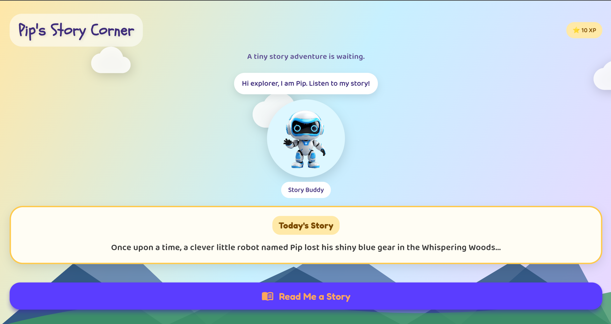
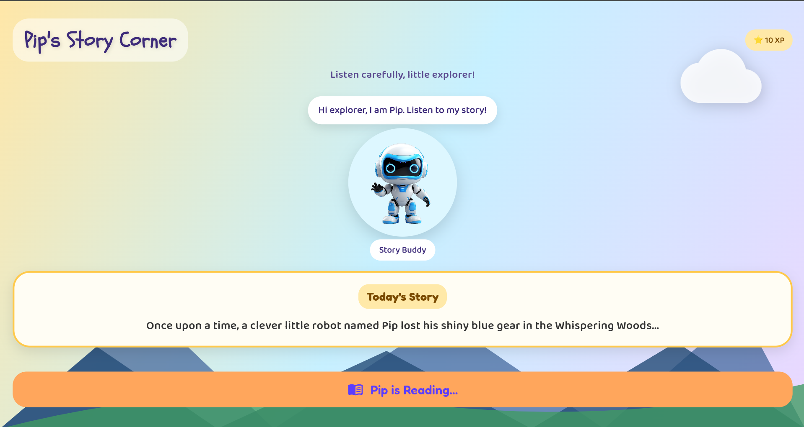
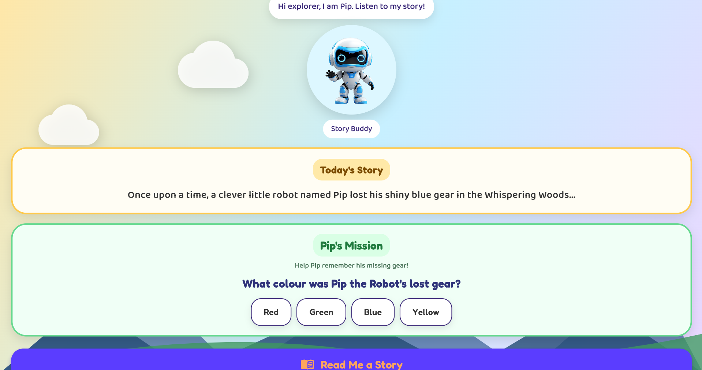

# Peblo Story Buddy

A Flutter-based interactive storytelling experience built for the Peblo Mobile App Developer Challenge.

## Overview

Peblo Story Buddy is a child-friendly storytelling application where children can listen to a narrated story and participate in an interactive quiz after narration.

The application focuses on engagement, accessibility, smooth animations, and lightweight performance suitable for mid-range Android devices.

---

## Features

- Text-to-Speech narration using flutter_tts
- Interactive quiz revealed after narration completes
- Data-driven quiz rendering from JSON
- Animated Story Buddy character
- Wrong-answer feedback
- Confetti celebration on success
- XP reward system
- Moving clouds and scenic background
- Child-friendly typography and UI

---

## Screenshots

### Home Screen


### Story Narration


### Quiz Screen


### Success State
.png)

.png)

---

## Tech Stack

- Flutter
- flutter_tts
- confetti
- flutter_animate
- google_fonts

---

## State Management

The application manages:

- Story narration state
- Quiz visibility state
- Success state
- UI feedback state

using lightweight local state management to keep the application responsive and simple.

---

## Data-Driven Quiz

The quiz is generated from a JSON structure.

Example:

```json
{
  "question": "What colour was Pip the Robot's lost gear?",
  "options": ["Red", "Green", "Blue", "Yellow"],
  "answer": "Blue"
}
```

The UI automatically renders any number of options without requiring code changes.

---

## Audio Flow

1. User taps Read Me a Story.
2. TTS narration begins.
3. Narration completion is detected.
4. Quiz appears automatically.
5. User answers the question.
6. Success feedback is displayed.

---

## Loading & Failure Handling

- Button disabled during narration.
- Reading state displayed.
- Retry mechanism supported.
- Graceful state transitions.

---

## Performance Considerations

- Lightweight asset usage.
- Minimal package footprint.
- Limited rebuilds.
- Smooth animations suitable for mid-range Android devices.

---

## AI Usage

AI tools were used for guidance, debugging, and exploring implementation approaches.

Final UI decisions, visual design choices, interaction flow, animations, and application integration were customized and implemented during development.

---

## Author

Nancy Khandelwal
